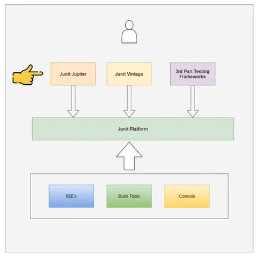
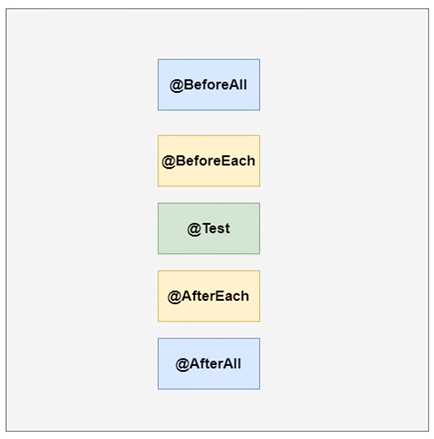
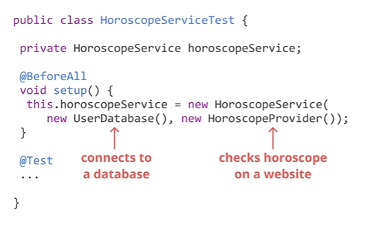
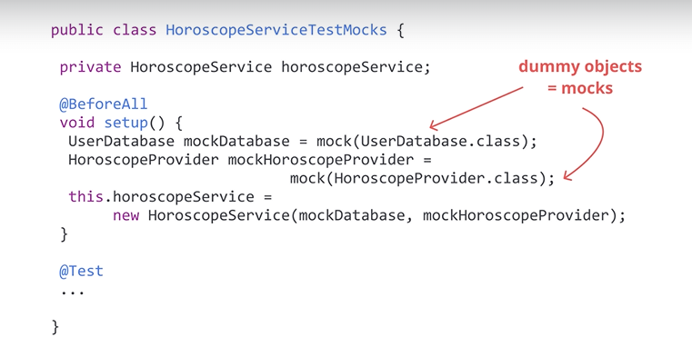

<center><h1>
    Mockito
    </h1></center>


#### Pre-Requisite

- Java Programming(Refer Java Class by DurgaSoft on Youtube)
- JUnit5

## JUnit5

JUnit is a simple testing framework to write and run repeatable tests. It provides a simple API to test our java application. The class or method we need to test is called subject under test. So to write a test we simply create a Java Test Class and use the Junit API to make some assumption  toward the behavior of subject under test. The JUnit verifies whether the assumption are correct or not. 

### Unit Testing

- Tests at the lowest level.
- They test single units/components of software.
- In Java, it checks a method.

```java
/*Method Under Test*/
double asCelsius(double temperatureFahrenheit){
	return ((temperatureFahrenheit-32)*5.0)/9.0;
}

/*Unit Test*/
@Test
void should_ReturnCorrectTemperatureAsCelsius(){
	assertEqual(asCelsius(41.0),5.0);
}
```

**Every good software must have unit test. Unit test increase confidence during development.**

### JUnit Architecture



On a high level JUnit5 is a combination of three different modules. 

**JUnit Platform** is the module which provides an API to launch the tests from either the Ide , buildtool or consoles.

**JUnit Jupiter ** is the module which provides an API to write our JUnit Test. For writing Unit Test using JUnit5 we use this module.

**JUnit Vintage ** is the module which provides backward compatibility for Unit Tests written with JUnit3 or JUnit4.

*JUnit platform module enables some 3rd Party Testing Frameworks to build their own API to write the tests and reuse the JUnit Platform to launch the tests.*

### Junit Test Lifecycle

So each Junit test when it is executed it will create a new instance of the test class and its follows different faces as part of the execution. Each face is represented with annotation in Junit5.



**@BeforeAll , @BeforeEach ** : Used to perform initialization tasks for tests.

**@AfterAll , @AfterEach **: Used to perform cleanup tasks for tests.

**@BeforeAll & @AfterAll are called only once for the entire test and the methods are usually marked as static.**

### JUnit 4 <> JUnit 5 

**Compatibility**

Running older JUnit 4 tests on the JUnit 5 platform --> possible

Running newer JUnit 5 tests on the JUnit 4 platform --> not possible

**Annotation name changes**

|   JUnit 5   |   JUnit 4    |
| :---------: | :----------: |
| @BeforeEach |   @Before    |
| @AfterEach  |    @After    |
| @BeforeEach | @BeforeClass |
|  @AfterAll  | @AfterClass  |
|  @Disabled  |   @Ignore    |

**Testing Exceptions**

To test exceptions in JUnit 5, we used assertThrows with an executable, that is a lambda expression.

In JUnit 4, however, we had to use @Test and inside the brackets we provided "expected=" and then the exception class.

**New in JUnit 5**

@Nested & @RepeatedTest not present in JUnit 4.


## Mockito 

It is a mocking framework. 

#### Why Mocking ?



**Imagine that you need to write unit tests for your horoscope service, but how can you do that?**

Your unit test, as the name suggests, should only focus on the horoscope service class, which has two other dependencies. Look at the screen now where we try to write a unit test using JUnit only. Look at the setup method. To instantiate the horoscope service, we also had to create new instances of user database and horoscope provider and as we already said, user database connects to a database and horoscope provider looks for a horoscope over the Internet on a website.

Our test, which was supposed to be a unit test focused on the horoscope service class, is no longer a unit test because under the hood it will also connect to a real database and it will also look up a horoscope on a website available on the Internet.

What if we don't have a database installed?

What if we don't have Internet connection?

Naturally, the test will fail when we run it, but it will fail for the wrong reason: not because the class under test, the horoscope service, works incorrectly, but because one of its dependencies has a problem.

This could be fine for an integration test, but we don't want such situations in a unit test.

If we write unit tests for horoscopes service, we want the tests to fail when and only when the horoscopes service class contains bugs.

So what can we do to actually test the horoscope service class?

Can we somehow avoid connecting to a real user database and going online to check the horoscopes?

Luckily, we can, instead of using real dependencies, we will use dummy dependencies, also known as mocks. Treat them as fake objects that only pretend to be the dependencies we need.



Here we didn't use the plain old Java new operator to create dependencies. Instead we use the mock method from Mockito to create dummy objects that behave as if they were real object of type User Database and Horoscope Provider.

##### Mocking is only done for its dependencies but we can't mock the method of same class itself.

### Return Values 

Mocks return the default values when it function are called. We can also specify our own return values for specific input.
